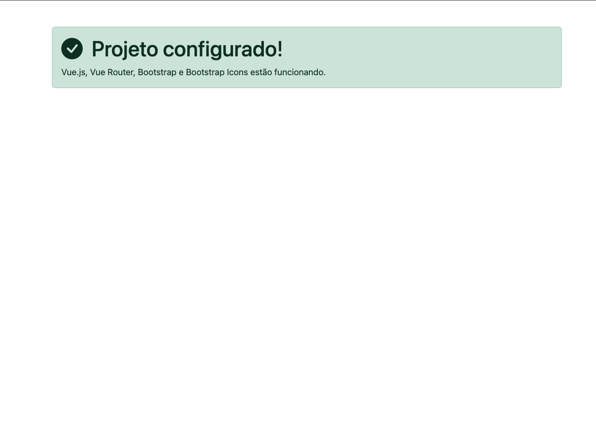

# Validação do projeto

Este guia reúne os procedimentos para confirmar que o ambiente e as principais
ferramentas estão funcionando.

## Evidência esperada

A página inicial demonstra o funcionamento conjunto do Vue.js, Vue Router,
Bootstrap e Bootstrap Icons.



## Instalação limpa

Em um clone novo, instale exatamente as dependências registradas no
`package-lock.json`:

```bash
npm ci
```

Durante o desenvolvimento cotidiano, utilize:

```bash
npm install
```

Se o npm apresentar `EBADENGINE`, confira `node --version`. A versão recomendada
está no arquivo `.nvmrc`.

## Servidor de desenvolvimento

```bash
npm run dev
```

Confirme se:

1. o terminal apresenta um endereço local;
2. a página inicial é carregada;
3. o alerta possui os estilos do Bootstrap;
4. o ícone do Bootstrap Icons é exibido;
5. não existem erros no console do navegador.

## Formatação

```bash
npm run format
```

Verifique se:

- a indentação utiliza dois espaços;
- os atributos Vue e HTML ficam em linhas separadas;
- as linhas consideram a largura preferencial de 80 caracteres;
- os arquivos terminam com uma nova linha.

## Análise estática

```bash
npm run lint
```

O script executa o Oxlint e o ESLint. A validação deve terminar sem erros. Caso
ocorra um erro, observe o arquivo, a linha, a coluna, a regra e a mensagem
apresentados no terminal.

## Build de produção

```bash
npm run build
```

O Vite deve criar o diretório `dist` e concluir sem erros. Esse diretório é
gerado automaticamente e não deve ser versionado.

## Pré-visualização do build

```bash
npm run preview
```

Abra o endereço apresentado para verificar a versão compilada.

## Verificação do Git

```bash
git status
git diff
```

Confirme que:

- `node_modules` e `dist` não aparecem para commit;
- não existem arquivos temporários;
- somente alterações intencionais serão enviadas;
- o `package-lock.json` está versionado.

## Checklist antes de um commit

- [ ] a aplicação inicia com `npm run dev`;
- [ ] a funcionalidade foi testada no navegador;
- [ ] o console do navegador não apresenta erros;
- [ ] o código foi formatado;
- [ ] o lint foi executado sem erros;
- [ ] o build foi concluído;
- [ ] as alterações foram conferidas com `git diff`;
- [ ] arquivos gerados não serão versionados;
- [ ] o README foi atualizado, quando necessário.

## Sequência recomendada

```bash
npm run format
npm run lint
npm run build
git status
git diff
```

Depois da conferência:

```bash
git add .
git commit -m "feat: descreva a alteração realizada"
git push
```

## Problemas comuns

### O projeto não inicia

Confira a versão do Node.js e reinstale as dependências. Não utilize `--force`
ou `--legacy-peer-deps` sem orientação do professor.

### O Prettier não formata

Confirme se a extensão está instalada e se o projeto foi aberto pela pasta
raiz. Também é possível executar `npm run format`.

### O Bootstrap não aparece

Confira as importações no arquivo `src/main.js`.

### A rota não carrega

Confira se:

- a página existe em `src/views`;
- a rota foi registrada em `src/router/index.js`;
- o Router foi registrado em `src/main.js`;
- `App.vue` possui `<RouterView />`.

## Referências

- [Vue.js](https://vuejs.org/);
- [Vue Router](https://router.vuejs.org/);
- [Vite](https://vite.dev/);
- [Bootstrap](https://getbootstrap.com/);
- [Bootstrap Icons](https://icons.getbootstrap.com/);
- [Axios](https://axios-http.com/);
- [EditorConfig](https://editorconfig.org/);
- [Prettier](https://prettier.io/);
- [ESLint](https://eslint.org/);
- [Oxlint](https://oxc.rs/docs/guide/usage/linter.html).
